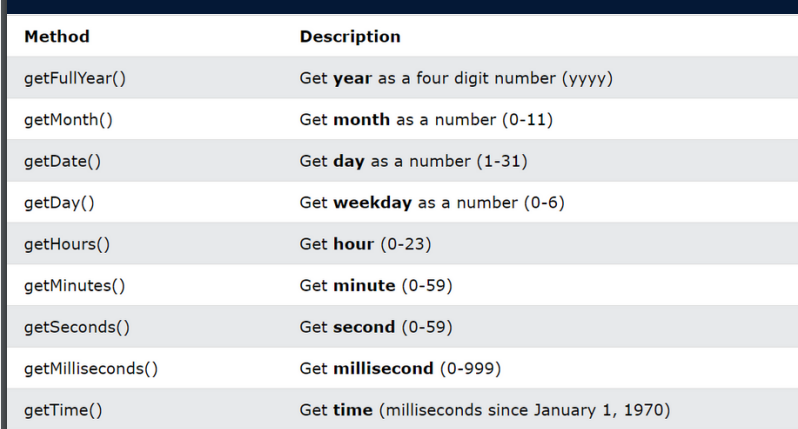
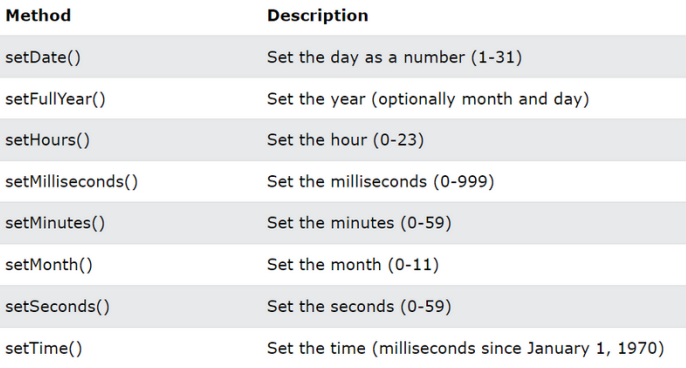

# new Date -чист 
## new Date  -ин конструктори нави обект мебошад
### методхои new date 
### 1  getFeullYear  ()
### 2 getMouth       ()
### 3 getDate        ()
### 4 getDay         ()
### 5 getHause       ()
### 6 getMinuts      ()
### 7 getSecond      ()
### 8 getMillisecond ()
### 9 getTime        ()

# new Set -чист 
## new Set  -ин конструктори нави обект мебошад
### методхои new Set
### 1  setFeullYear  ()
### 2 setMouth       ()
### 3 setDate        ()
### 4 setDay         ()
### 5 setHause       ()
### 6 setMinuts      ()
### 7 setSecond      ()
### 8 setMillisecond ()
### 9 setTime        ()

# new Map -чист 
## new Map  -ин конструктори нави обект мебошад
### методхои new Map 

